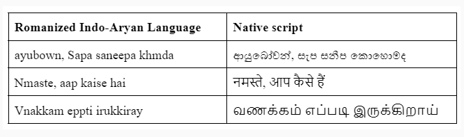

# Romanized Indo-Aryan Language Reverse Transliterator

## Overview

**Typing Romanized Indo-Aryan languages** (native languages written using English alphabets) using adhoc transliterations, with or without vowels, and achieving accurate native script output is often challenging. Existing keyboard systems frequently fail to provide accurate transliteration, resulting in a subpar user experience. 

This project introduces a **real-time reverse transliterator**, designed to convert Romanized Indo-Aryan language input into its corresponding native script. By improving the accuracy of transliteration, we aim to enhance the typing experience for users who prefer using Romanized alphabets for Indo-Aryan languages.

## Task Objective

The primary goal of this project is to develop and evaluate a tool that:
- Accurately converts Romanized Indo-Aryan language text to native script in real-time.
- Handles transliterations with or without vowels, and resolves the ambiguities that arise from such variations.
- Provides a seamless typing experience for users by addressing the inaccuracies present in current keyboard systems.

## Important Dates

- 1st Call for Registration :July 20, 2024
- 2nd Call for Registration : July 31, 2024
- Registration Closing : August 31, 2024
- Intial Briefing :September 2, 2024
- Test Data released: October 11, 2024    New
- Shared Task Completion :November 15, 2024
- Paper Submission Deadline :November 30, 2024

## Language Test Sets

This Test dataset has been created and augmented specifically for the INdoNLP Shared Task 2025. Please note that some data records are a combination of existing datasets that are publicly available for the respective languages. The augmentation process involved generating new data samples based on these existing resources while ensuring data diversity and relevance to the task.

We want to give full credit to the authors and original creators of the datasets from which the data has been derived. Their contributions have been invaluable in the development of this dataset.

| Language   | Test Set 1: General Typing Patterns | Test Set 2: Adhoc Typing Patterns   |
|------------|--------------------------------------|------------------------------------|
| Sinhala    | 10000                                | 5000                               |
| Bengali    | 10000                                | 5000                               |
| Gujarati   | 5000                                 | 5000                               |
| Hindi      | 5000                                 | 5000                               |
| Malayalam  | 10000                                | 5000                               |

## Submission

- The developed transliteration model/code.
- A report detailing the approach, challenges faced, and solutions implemented.
- A detailed discussion about the evaluation techniques/frameworks used.
- A short paper (4 pages)

For any inquiries or concerns regarding this dataset, please contact us at: indonlp2025@gmail.com
